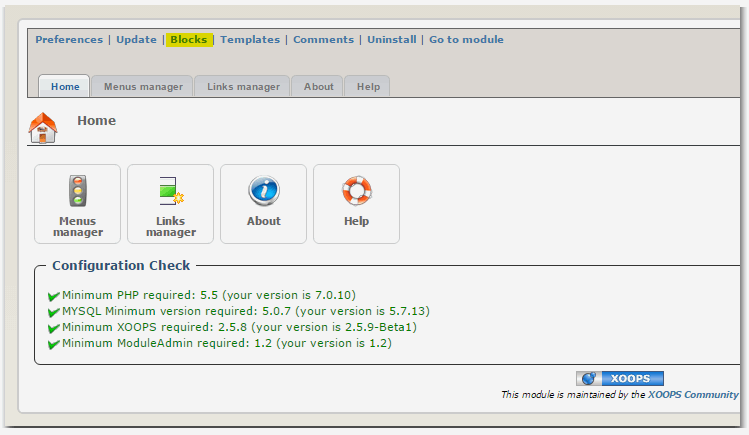
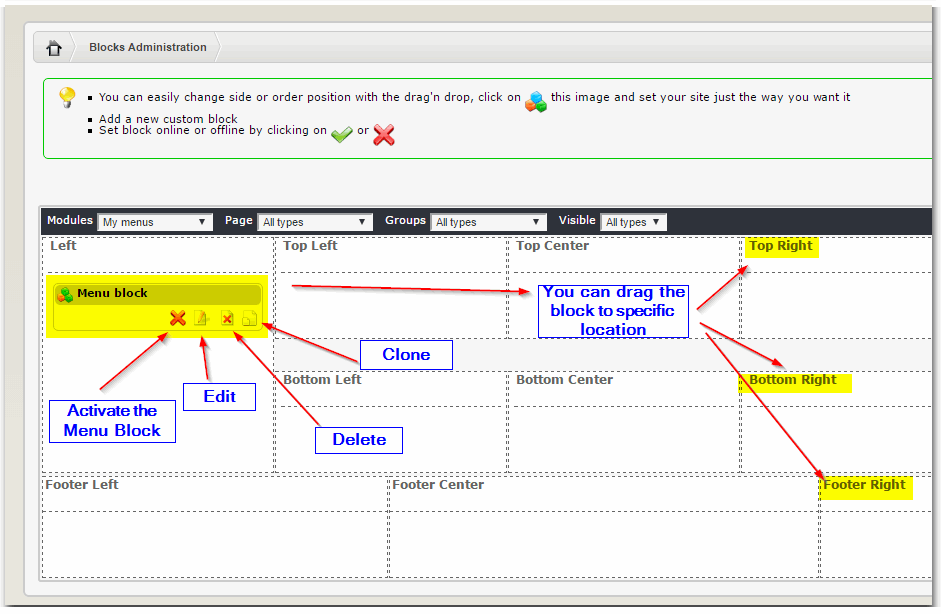
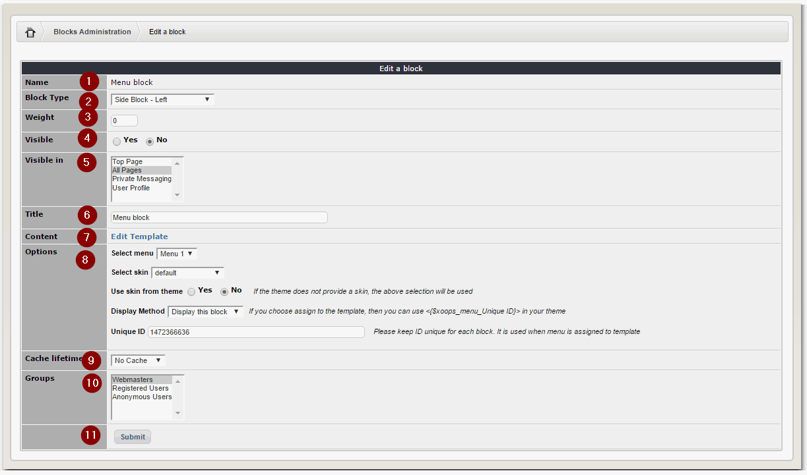
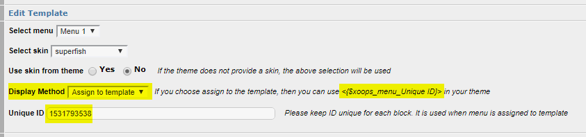

# Blocks

The Menu is created by using Blocks.



Just click on the "Blocks" link...



Once you click, XOOPS opens the Blocks view. MyMenus module has as default only one block, but you can clone it as many times as you like.

As first, you should "activate" the block.

You can also drag the block to specific location, where you would like to show it to your visitors.

Finally, you can edit, or delete the block.



When you click on Edit, you can customize the menu to your needs:

| Field \# | Description |
| --- | --- |
| 1 | Name of the Block |
| 2 | Here you can select the location of the Block, or you can do it later by dragging the block around |
| 3 | You can set the "weight" of the block, so the blocks can be sorted |
| 4 | You can set the block "off-line", i.e. deactivate it |
| 5 | Here you can decide where do you want this menu block to be visible. You can select only tho Top Page, or All Pages. You can also select specific module, or any combination of all of the above choices |
| 6 | You can change the title of the Block, that the users will see |
| 7 | You change the "look & feel" of the block, by modifying the template of the Block |
| 8 | Here you have different options for the Block: - select which Menu do you want to show  - select the skin for the Block  - you can select the skin provided by the Theme  - decide if you want to display the Block individually, or to make it as part of your template |
| 9 | You can select cache between no cache, to 1 month cache |
| 10 | Select the groups that will be allowed to see the Menu Block |
| 11 | Once you done, you can save it |

## Adding Menu Block Directly in Theme

You can add a MyMenus block directly in a theme, by assigning it to a Smarty template in your block: 





Once you save the block, then you can add at the template of your choice the Smarty variable, e.g. here I've added it in the menu file ```/tpl/nav-menu.tpl``` located in the **xbootstrap **theme: 
```html
<li class="nav-item"><{$xoops_menu_1531793538}></li>
```


